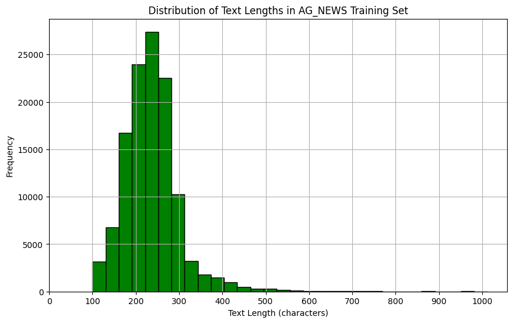
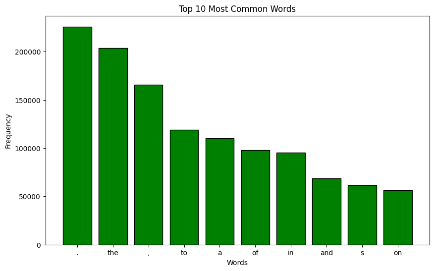
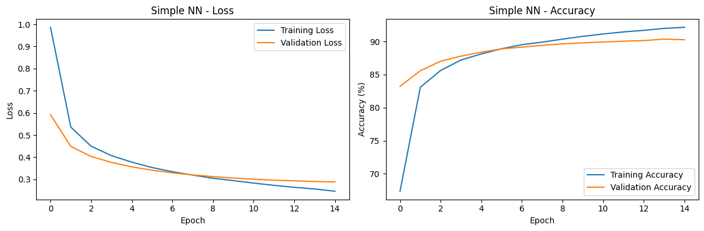
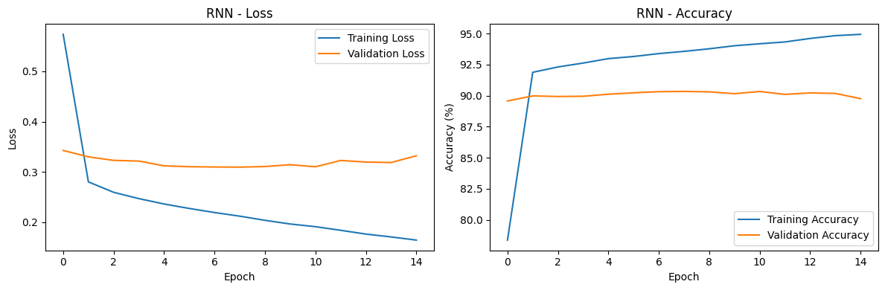
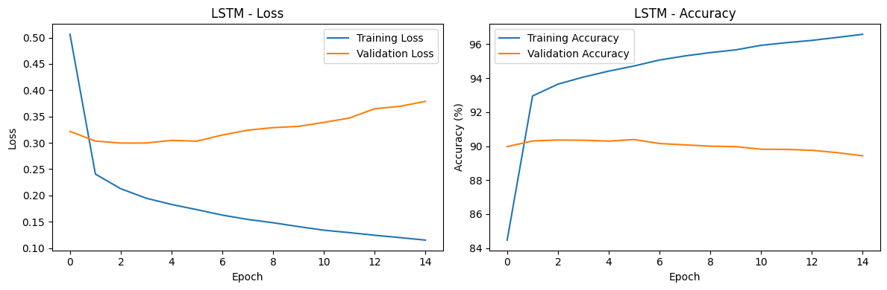
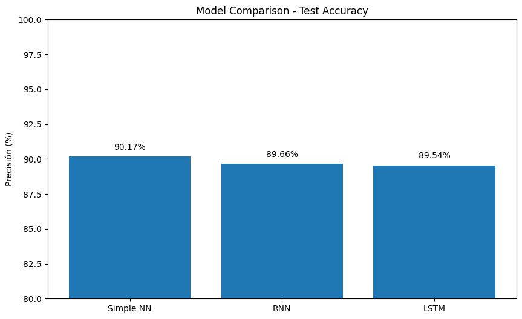

# Exploring Neural Networks for Text Classification Tasks

## Introduction

This project involves building and training neural network models to classify news articles into categories using the AG_NEWS dataset. The main objectives are to perform exploratory data analysis, preprocess the data, and implement different neural network architectures for text classification.

## Part 1: Exploratory Data Analysis

#### Classes and Distribution in the Dataset

The AG_NEWS dataset contains news articles grouped into four categories:

1. **World**
2. **Sports**
3. **Business**
4. **Sci/Tech**

Analyzing the class distribution in the training set reveals that the dataset is relatively balanced, with each category containing approximately 30,000 samples.

#### Distribution of Text Lengths

We examine the length of the news articles by calculating the number of characters in each text. The majority of articles have lengths ranging from 100 to 500 characters, indicating that most articles are concise.

#### Most Common Words in the Dataset

After tokenizing the text, we identify the most frequently occurring words. Common words include typical stopwords such as "the," "to," "and," "of," and "in." These words are often less informative for classification purposes.

## Part 2: Preprocessing

#### Text Normalization, Tokenization, and Lemmatization

To prepare the data for modeling, we perform several preprocessing steps:

- **Normalization**: Convert all text to lowercase and remove non-alphabetic characters to reduce variability.
- **Tokenization**: Split the text into individual words using a basic English tokenizer.
- **Stopword Removal**: Remove common English stopwords that may not contribute meaningful information.
- **Lemmatization**: Reduce words to their base or dictionary form to address issues of word inflection.

#### Building the Vocabulary

We build a vocabulary from the preprocessed training data, limiting it to the most frequent 20,000 words. Special tokens for padding (`<PAD>`) and unknown words (`<UNK>`) are included to handle varying text lengths and out-of-vocabulary words.

#### Embedding Initialization with GloVe

We initialize word embeddings using pre-trained GloVe vectors (50-dimensional). This approach leverages semantic information learned from a large corpus, potentially improving the model's performance.

## Part 3: Neural Networks for Text Classification

We implement and compare three different neural network architectures:

#### 1. Simple Feedforward Neural Network (FFNN)

- **Architecture**: Consists of an embedding layer followed by average pooling and fully connected layers.
- **Purpose**: Serves as a baseline model to assess the effectiveness of more complex architectures.

#### 2. Recurrent Neural Network (RNN)

- **Architecture**: Utilizes RNN layers to process sequences of word embeddings, capturing temporal dependencies in the text, followed by a fully connected layer.
- **Purpose**: Designed to capture the sequential nature of text data, considering word order and context.

#### 3. Long Short-Term Memory Network (LSTM)

- **Architecture**: Employs LSTM layers to capture long-term dependencies in sequences, improving upon standard RNNs, followed by a fully connected layer.
- **Purpose**: Addresses the vanishing gradient problem in RNNs by allowing the model to retain information over longer sequences.

### Training and Evaluation

#### Data Preparation

- **Datasets**: The preprocessed data is divided into training, validation, and test sets.
- **Data Loaders**: Implemented to handle batching and padding of variable-length sequences.

#### Training Details

- **Loss Function**: Cross-Entropy Loss is used for multi-class classification.
- **Optimizer**: Adam optimizer is selected for efficient training.
- **Hyperparameters**: Learning rate, batch size, and number of epochs are set based on initial experiments.

#### Evaluation Metrics

- **Accuracy**: Measures the proportion of correctly classified samples.
- **Confusion Matrix**: Provides detailed insight into model predictions versus actual classes.
- **Classification Report**: Includes precision, recall, and F1-score for each class.

### Results

#### Performance Comparison

- **FFNN**: Achieved reasonable accuracy, comparable to the other models.

The plot shows the comparison between training and validation loss over epochs. The gradually decreasing curves indicate effective model learning, with minimal overfitting as both curves follow similar trends. The validation loss stabilizes around epoch 10, suggesting optimal model convergence.

- **RNN**: Achieved similar accuracy to FFNN, showing that sequential processing provided minimal benefits for this task.

The RNN model shows a more gradual decrease in both training and validation loss compared to the FFNN. While the model learns consistently, the validation loss exhibits some fluctuations, particularly after epoch 5, suggesting slightly less stable convergence than the FFNN model.

- **LSTM**: Demonstrated lower performance and more overfitting compared to simpler models. Additional optimization needed.

The LSTM model shows slightly higher loss values compared to the FFNN and RNN models, with more pronounced fluctuations in both training and validation curves. While the model learns, the gap between training and validation loss suggests some overfitting after epoch 7. To improve results, we could:

1. Increase dropout rate to reduce overfitting
2. Experiment with different learning rates
3. Add regularization layers
4. Reduce model complexity
5. Implement early stopping

#### Observations

Based on the training and validation loss plots:
- The FFNN showed the most stable learning curve with good convergence around epoch 10
- The RNN demonstrated consistent learning but with more fluctuations in validation loss
- The LSTM exhibited higher loss values and clear signs of overfitting after epoch 7, suggesting that its additional complexity may be detrimental for this task

### Conclusion
This project compared three neural network architectures for text classification: FFNN, RNN, and LSTM. The results indicate that simpler architectures (particularly FFNN) performed better than more complex ones. The FFNN achieved stable convergence with minimal overfitting, while the LSTM's additional complexity led to higher loss values and overfitting issues. This suggests that for this particular news classification task, simpler architectures might be more appropriate, and adding sequential processing capabilities does not necessarily improve performance.

Key takeaways:
- Simpler architectures performed better
- Pre-trained embeddings were beneficial
- Further optimization could improve LSTM performance through regularization techniques

### References

- **AG_NEWS Dataset**: [TorchText Documentation](https://pytorch.org/text/0.12.0/datasets.html#ag-news)
- **GloVe Embeddings**: [GloVe: Global Vectors for Word Representation](https://nlp.stanford.edu/projects/glove/)
- **PyTorch**: [PyTorch Official Website](https://pytorch.org/)
- **NLTK**: [Natural Language Toolkit](https://www.nltk.org/)
